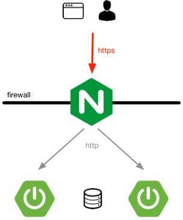

This section provides insight on how to deploy and configure an IAM service
instance.

IAM is a [spring boot application][spring-boot] designed to run behind an [NGINX][nginx]
reverse proxy, which is used for TLS termination and possibly load balancing.
The IAM service instances keep all state in a MariaDB/MySQL database, as shown
in the following picture:

## Prerequisites

At the bare minimum, to run a production instance of the instance of the IAM
you will need:

- An X.509 certificate, used for SSL termination at the NGINX reverse proxy;
  you can get one for free from [Let's Encrypt][lets-encrypt];
- An NGINX server configured to act as a reverse proxy for the IAM web
  application; more details on this in the [NGINX section](nginx);
- A MariaDB/MySQL database instance; more on this in the [database
  configuration](mariadb)
  section;
- A JSON keystore holding the keys used to sign JSON Web Tokens; more on this
  in the [JWK section](jwk);

You will also need to choose whether you want to deploy you service as a
[docker container](docker) (recommended) or install from
[packages](packages).

And finally, you will have to setup a minimal IAM configuration and change the
administrator password for the newly configured IAM service; more on this
[in the basic configuration section](basic_setup).

[lets-encrypt]: https://letsencrypt.org/
[spring-boot]: https://spring.io/projects/spring-boot
[nginx]: https://www.nginx.com/
