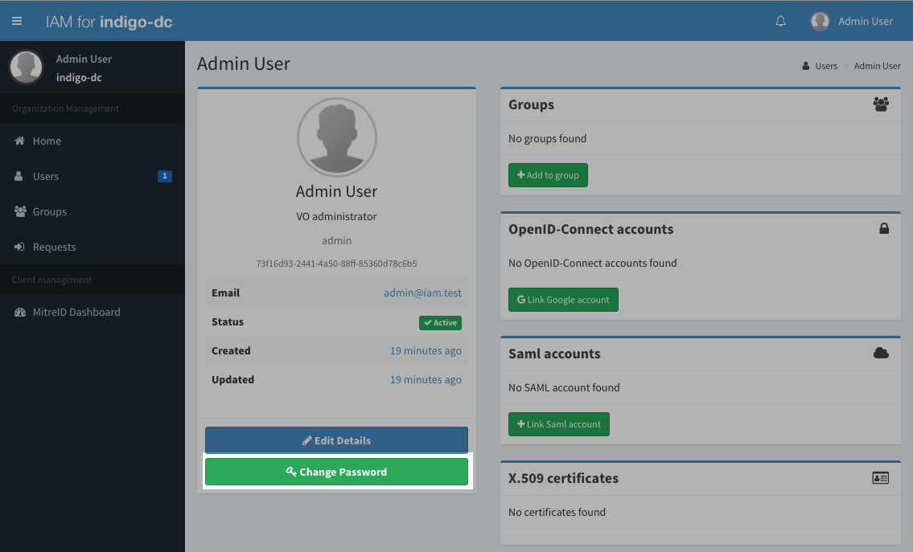

Most configurable aspects of the IAM are configured via environment variables
and Spring profile directives. For a detailed reference of all the options, see 
[the configuration reference][config-ref].

At the bare minimum you should enable the registration service to let users
register at your organisation (but you can leave it disabled and add users
manually to the organisation using the IAM dashboard if you prefer).

A minimal example configuration is given below: 

```bash
IAM_JAVA_OPTS=-Dspring.profiles.active=prod,registration -Djava.security.egd=file:/dev/./urandom
IAM_HOST=iam.local.io
IAM_BASE_URL=https://iam.local.io
IAM_ISSUER=https://iam.local.io
IAM_USE_FORWARDED_HEADERS=true
IAM_KEY_STORE_LOCATION=file:/iam-keystore.jwks
IAM_DB_HOST=db
IAM_DB_NAME=iam
IAM_DB_USERNAME=iam
IAM_DB_PASSWORD=***********
IAM_NOTIFICATION_FROM=iam@iam.local.io 
IAM_NOTIFICATION_ADMIN_ADDRESS=iam-administrators@mail.example
IAM_MAIL_HOST=smtp.mail.example
```

and has the following meaning:

- `IAM_JAVA_OPTS` is used to select active profiles (prod, registration) and
  tell the JVM to use /dev/urandom as the random number generator;
- `IAM_HOST` is the host where the IAM will listen for request; this is the
  hostname of the machine exposed to the internet;
- `IAM_BASE_URL` is the base URL where the IAM web application will live; the
  value for this is typically `https://${IAM_HOST}`;
- `IAM_ISSUER` is the OpenID-connect issuer for the tokens issued by the IAM;
  we recommend using the same setting as `IAM_BASE_URL`, i.e.
  `https://${IAM_HOST}`;
- `IAM_USE_FORWARDED_HEADERS` tells the IAM that whether it lives behind a reverse
  proxy (i.e., NGINX); in production the value is typically `true`;
- `IAM_KEY_STORE_LOCATION` is the location of the JSON Web keystore generated
  as explained [here](docs/getting-started/jwk);
- `IAM_DB_*` are variables used to set the database endpoint and provide
  database access credentials;
- `IAM_NOTIFICATION_FROM` sets the sender of administrative notification sent
  by the IAM;
- `IAM_NOTIFICATION_ADMIN_ADDRESS` sets the email address that will receive
  administrative notifications from the IAM;
- `IAM_MAIL_HOST` is the SMTP server that IAM will use to deliver
  notifications.

For a detailed reference of all available configuration options, see [the
configuration reference][config-ref].
 
Deploying and starting the IAM service with the above configuration will give
you an empty service with just one user registered, the `admin` user.

{}

As a first thing you should login in the IAM with the following credentials:

- username: `admin`
- password: `password`

{}

and change the password for the admin user, clicking on the __Change password__
button from the admin home page, as shown in the following picture:




[config-ref]: 
