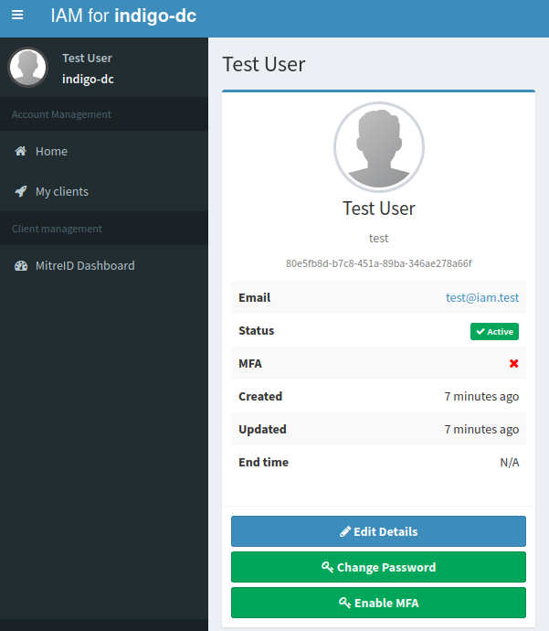
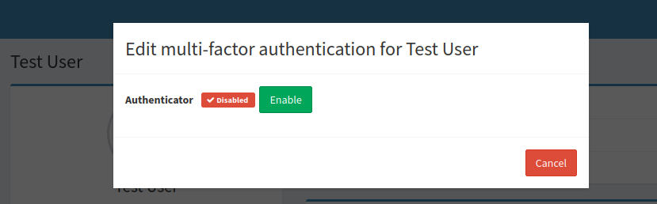
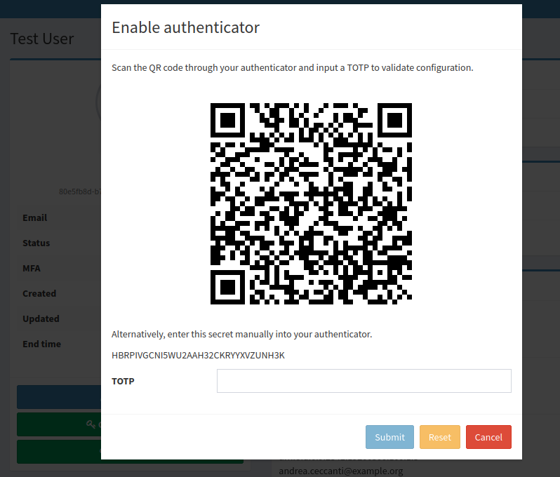
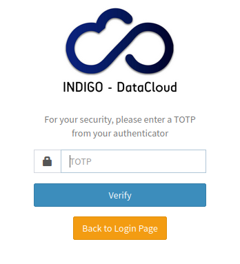
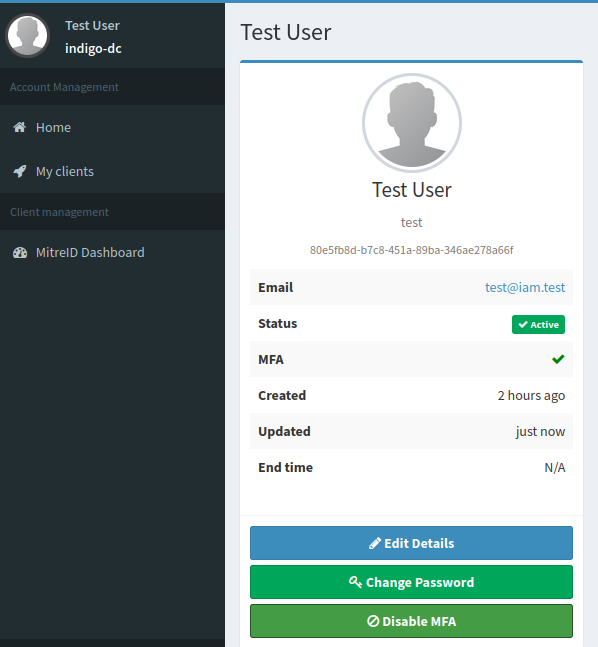
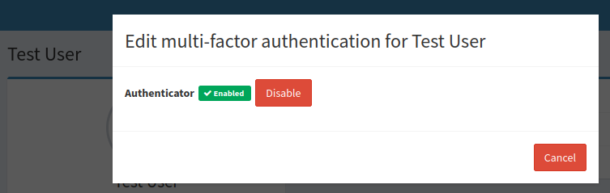
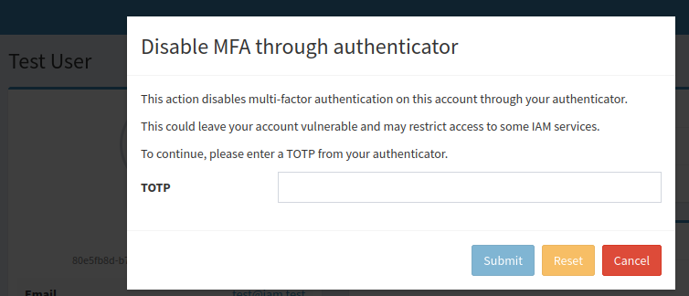
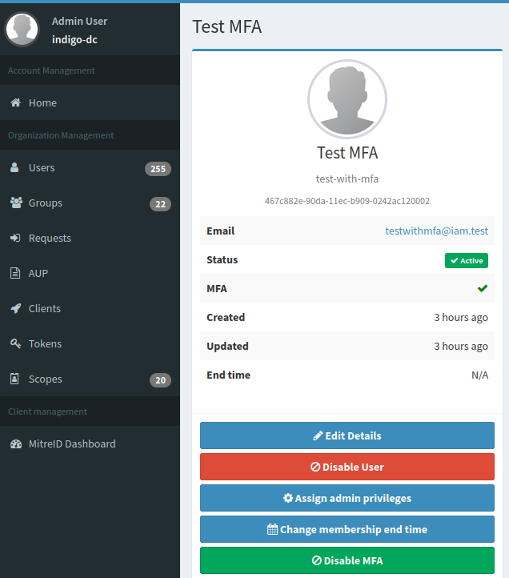
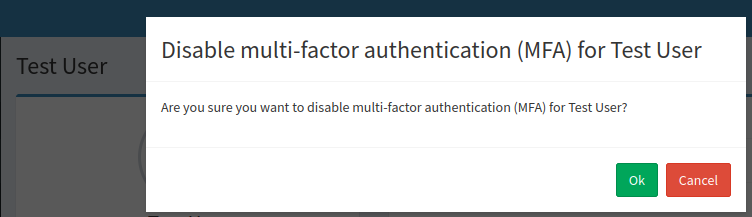

To enhance account security and align with modern security standards, Multi-Factor Authentication (MFA) has been introduced in the INDIGO IAM service.

MFA allows users to add an additional layer of security by registering a second authentication factor. Once enabled, a username and password alone will no longer suffice for login access.

The primary goals of MFA are:

* **Strengthening security**: Reducing the risk of unauthorized access, even if login credentials are compromised
* **Compliance**: Meeting client security policies that mandate the use of multi-factor authentication

To enable MFA, the `mfa` profile must be configured.

## How to enable MFA

Authenticated users can enable MFA through a button in their homepage.

Steps to enable MFA:

1. **Click the _Enable MFA_ button**

    

    Then, click on _Enable_.

    

2. **Confirm activation**

    A dialogue box will appear, prompting the user to enter a Time-based One-Time Password (TOTP) generated by an authenticator (e.g., _Ente Auth_ app).

    

3. **Submit the TOTP**

    Enter the TOTP into the field provided and click _Submit_. If the code is correct, MFA will be successfully enabled.

4. **Login with MFA**

    Once MFA is enabled, each login will require:

    * Username and password
    * A second factor (the TOTP) entered on a follow-up page

    

## How to disable MFA

Users can disable MFA by following these steps:

1. **Click on _Disable MFA_ button**

    

    Then, click on _Disable_.

    

2. **Confirm deactivation**

    A dialogue box will appear, prompting the user to enter the TOTP.

    

3. **Submit the TOTP**

    Enter the TOTP into the field provided and click _Submit_. If the code is correct, MFA will be successfully disabled.  
    From this point forward, the user will no longer need to provide a second authentication factor during login.

## In case of problems with the authenticator

If users experience issues with their authenticator app, they can request IAM administrators to disable MFA on their behalf.

Administrators should go to the user’s homepage and click the _Disable MFA_ button.

A confirmation dialogue will appear. Click _Ok_ to finalize the process.

Once completed, MFA will be disabled for the user, allowing them to log in without the second authentication factor.
