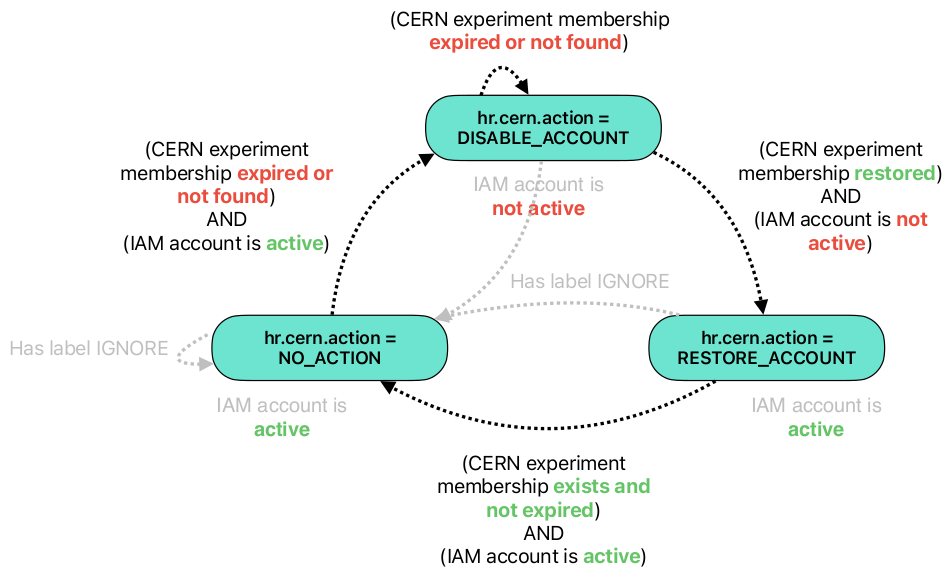

Labels for expired accounts:

|    label name    |               label value               |                                              meaning                                         |
|------------------|-----------------------------------------|----------------------------------------------------------------------------------------------|
| lifecycle.status | PENDING_SUSPENSION                      | added when the user membership expires; indicates that the user is waiting to be suspended   |
| lifecycle.status | PENDING_REMOVAL                         | added when the user is suspended; indicates that the user is waiting to be removed           |
| lifecycle.timestamp | _timestamp_                          | the instant at which the user is marked as awaiting suspension or removal                    |

Indigo IAM communicates with the CERN HR database to automatically synchronise and update user credentials and authorisations within the system.  
There is a chron job that runs every six hours and synchronises user membership information from the CERN HR DB with that of IAM.

Specific labels can be added to the user account at this time:

|    label name    |               label prefix               |        label value     |                                             meaning                                                          |
|------------------|------------------------------------------|------------------------|--------------------------------------------------------------------------------------------------------------|
| cern_person_id   |                hr.cern                   |    _id_                | a unique identifier assigned to each CERN employee and stored in the CERN HR DB                              |
| action           |                hr.cern                   |    DISABLE_ACCOUNT     | added when CERN experiment membership is expired or not found; the IAM account is then disabled              |
| action           |                hr.cern                   |    RESTORE_ACCOUNT     | added when CERN experiment membership is restored but IAM account is inactive; the account is then restored  |
| action           |                hr.cern                   |    NO_ACTION           | added when the previous state does not change                                                                |
| ignore           |                hr.cern                   |                        | if present, the account is ignored during the identity and access management processes                       |
| skip-email-synch |                hr.cern                   |                        | if present, email synchronization for that account is skipped                                                |
| status           |                hr.cern                   |    OK                  | added when account is disabled, restored or when no action is performed                                      |
| status           |                hr.cern                   |    ERROR               | added when cern_person_id misses or when there is an error contacting CERN HR DB api                         |
| timestamp        |                hr.cern                   |    _timestamp_         | the instant at which the chron job runs and the account is handled                                           |
| message          |                hr.cern                   |    _message_           | an error or ignore message                                                                                   |

The following graph shows the lifecycle of account labels in a simplified manner:

