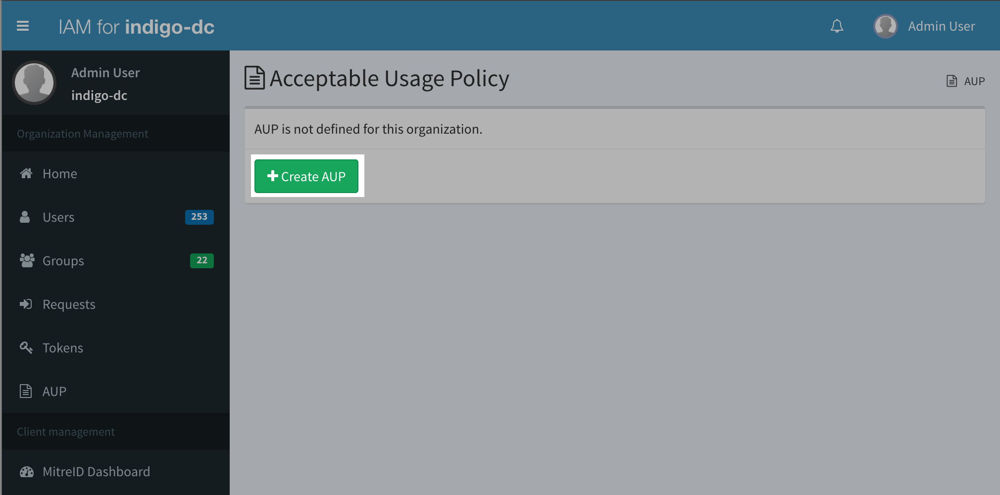
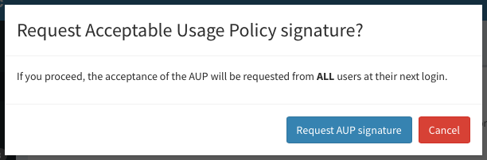
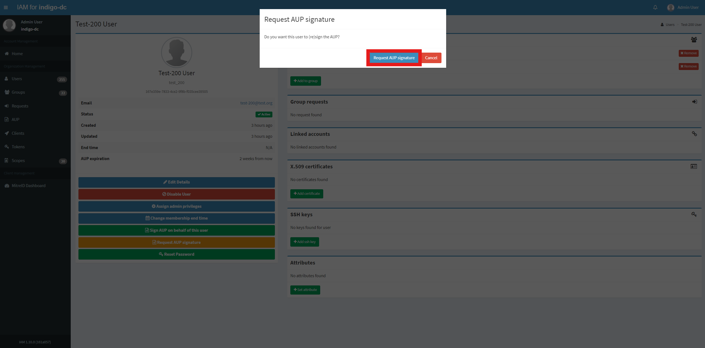
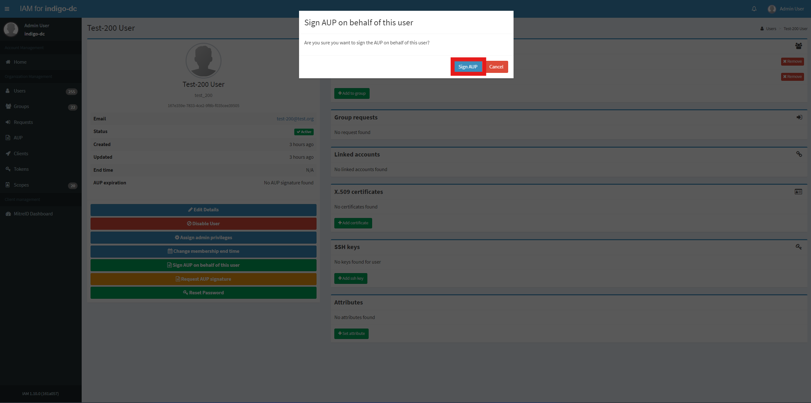

Starting with version 1.2.0, IAM supports defining an **Acceptable Usage Policy
Document (AUP)** for a managed organization. The AUP is presented to applicants
at registration time or periodically. 

## Managing the AUP 

The AUP can be managed from the "AUP" section in the IAM dashboard, or via the
[AUP management API](). 

Administrator privileges are required.

### Creating the AUP

By default, the AUP is not defined for an organization, i.e. it must be
explicitly defined by an IAM administrator. 

The AUP can be created by clicking on the "Create AUP" button in the AUP
management page (that can be reached clicking the "AUP" link in the organization
Management navigation bar):

A dialog is shown:

where the administrator can enter the AUP URL and define how frequently the
AUP should be accepted by users.

If the AUP signature validity is set to 0, a signature on the AUP will be
requested only once (either at registration time or at the first IAM login
after the AUP creation). A zero value means basically that the AUP signature
does not expire.

A positive value in the AUP signature validity means, on the other hand, that
the signature will expire after that number of days. As an example, an
administrator that wants the AUP to signed each year by users should put 365 in
the "AUP signature validity" field.

Since version 1.10.0, a new cron task has been added that runs every four hours to check the expiration status of each user's AUP (Acceptable Usage Policy) signature. If a signature has expired or is about to expire, an email notification is sent to the relevant user.

Administrators can configure AUP reminders, which notify users of the remaining days until their AUP expires. These reminders can be set up directly from the dashboard.
If the AUP signature validity is set to 0, AUP reminders will not be displayed. If the AUP signature validity is set to a value greater than 0, the AUP reminders will become mandatory.

#### Successful AUP creation criteria

* **Valid AUP URL**
  * The AUP URL must be a properly formatted, valid URL
* **AUP signature validity**
  * The signature validity period (in days) must be an integer value greater than or equal to 0
* **AUP reminders**
  * The reminder period(s) (in days) must be one or more numbers, separated by commas if multiple, that satisfy the following conditions:
    * Each reminder must be greater than 0
    * Each reminder must be less than the AUP signature validity period

Based on the screenshot above, the user will receive three AUP signature reminder emails at 30 days, 15 days, and 1 day prior to the expiration date. Additionally, one AUP expiration email will be sent one year after the AUP is signed.

### Editing and deleting the AUP

The AUP can be edited and deleted from the AUP management page:

Since version 1.6.0, the AUP has been converted from text to a URL.
If you have just upgraded to 1.6.0 and you have already defined a text AUP,
you should see the following red message below your AUP:

By clicking on "Edit AUP", admins are prompted to insert a valid URL.

As shown in the picture above, editing the AUP will not trigger an AUP signature request.

### Request a signature from users

If you want to request a signature from users for the updated AUP, 
use the "Request AUP signature" button in the AUP management page.

A dialog is shown:

Confirm by clicking on "Request AUP signature" and the acceptance of the AUP
will be requested from ALL users at their next login.

## Signing the AUP

Once defined the AUP text is shown to users for acceptance either
at registration time:

or at the first login after the AUP creation:

## Request AUP signature

Administrator can request user to sign AUP.

Administrator privileges are required.

Log into the service using admin credentials and click on the _Users_ link on the left navigation bar:

From the _Users_ link, select _Any user_ you want to request AUP signature, for example _Test-200 User_:

To request AUP signature click on _Request AUP signature_ button on _User details_ section on the left of the page:

To confirm your choice click on _Request AUP signature_ button on the modal window:

On success you will get a confirmation message:

After this operation, if the user logs in, they must sign the AUP again before accessing the service.

## Sign AUP on behalf of the user

Administrator can sign AUP on behalf of the user.

Log into the service using admin credentials and click on the _Users_ link on the left navigation bar:

From the _Users_ link, select _Any user_ you want to sign AUP on behalf, for example _Test-200 User_:

To sign AUP on behalf of the user click on _Sign AUP on behalf of this user_ button on _User details_ section on the left of the page:

To confirm your choice click on _Sign AUP_ button on the modal window:

On success you will get a confirmation message:

