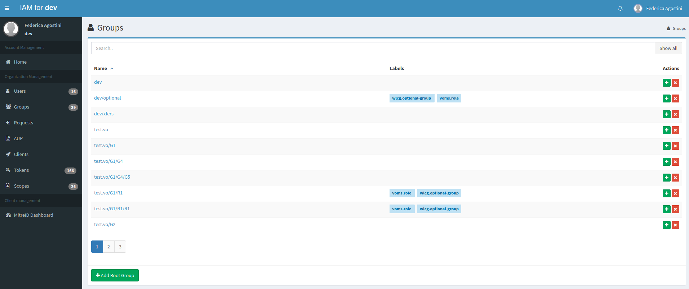
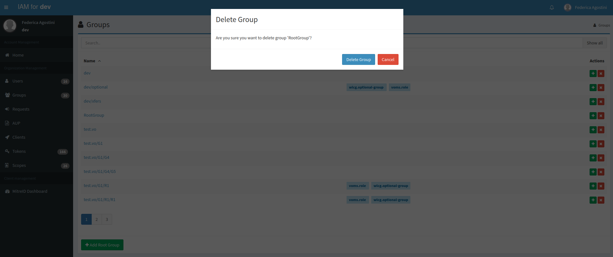
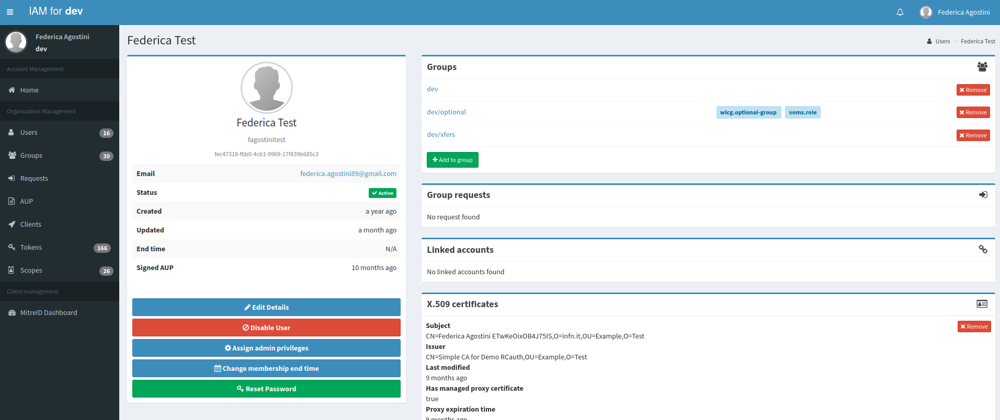
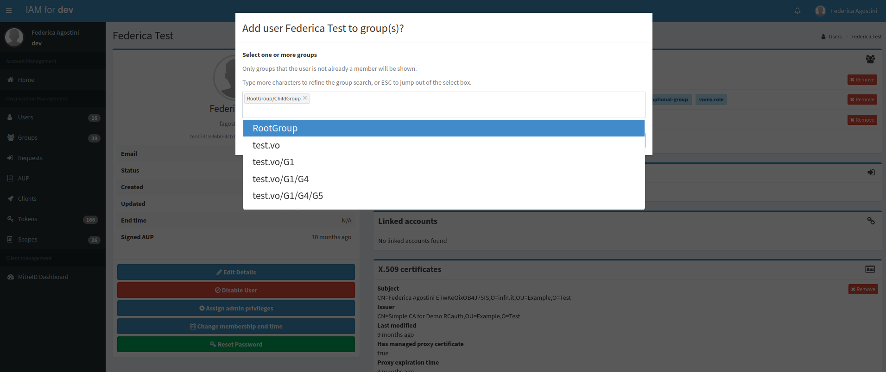
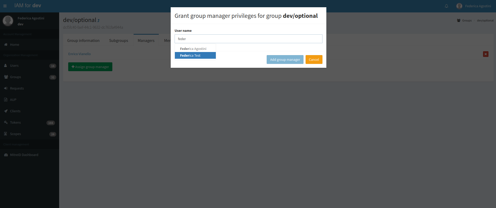
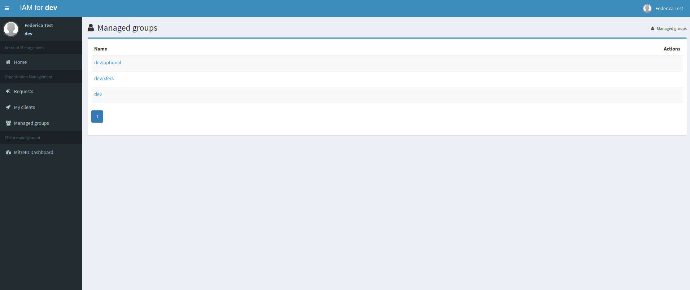
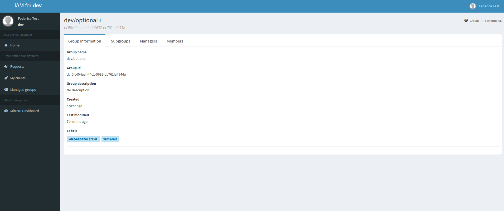
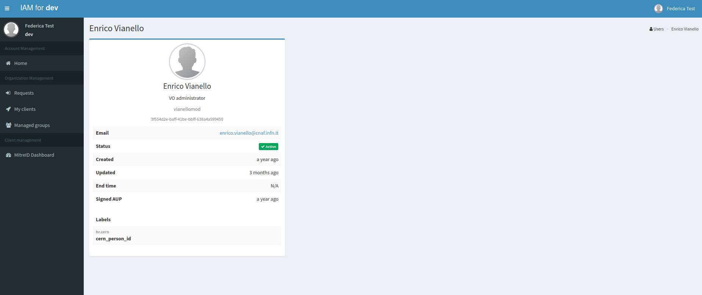

IAM provides a group management system, that can be used by IAM Administrators
and Group Managers to create groups, remove existing ones and manage membership in the group.

Groups can be organized in a hierarchical structure, with the following constraints:
 - a group can have only a parent group;
 - a group can have many childrens.

## Manage groups as IAM Admin

The simplest way to manage groups is using the IAM dashboard.

### Creating a group

From the home page, open the _Groups_ section and click the _Add Root Group_ button:

To create a group, specify a group name.

A new children group can be created from the parent group details page,
clicking on the _Add a subgroup_ button of the _Subgroups_ upper tab.

### Deleting a group

From the groups list page, click on the corresponding _X_ button.
A confirmation window will be opened, so you can confirm or abort the
the delete operation.

**Only empty groups can be removed. If you try to remove a group
with a child group or with user members, the operation is aborted.**

### Managing membership for a group

To add a user to a group open the user details page.
In the _Groups_ section, click on the _Add to group_ button:

Choose one or more groups and confirm the operation:

Starting with version 1.7.0, when a user is added as member of the children group `A/B`, IAM
takes care of adding them also to the parent group `A` that
they is not already a member of.  In previous versions this had to be done
manually by the IAM administrator. Following the same rationale, when a user is
removed from the parent group `A`, it is also automatically removed from any children groups
(e.g. `A/B`) it is a member of.

To remove a user from a group, click the _Remove_ button.

Members can also be removed from the group details page, clicking on the corresponding _X_ button
as shown in the following screenshot:

### Assign Group Manager privileges

Group Managers are IAM users with privileges that allow to manage groups.

In order to assign Group Manager privileges to a user, you can select the group,
click on the _Managers_ tab and then on _Assign group manager_.
A popup window will appear to search for IAM users: after selecting the
corresponding user that want to became Group Manager, click on _Add group manager_.

## Manage groups as Group Manager

Starting from IAM version 1.8.1, when a user is a Group Manager a left tab _Managed groups_
that lists the groups they are group manager of appears in the homepage.

Once the Group Manager click on a group, what they can see in the upper tabs is

* detailed view of group information (_Group information_)
* list of children groups, if any (_Subgroups_)
* list of Group Managers (_Managers_)
* list of group members, if any (_Members_)

The Group Manager has also the possibility to click on group members, where a limited
view of user information (including name, surname, uuid, username, email, status, created, updated,
end time and labels) is shown.

### Group Manager actions

A Group Manager in IAM does not have the same privileges as the IAM Admin in managing groups.

What they can do, beside being allowed to browse into the group details, is

* approve/reject membership requests
* delete users from their managed groups.