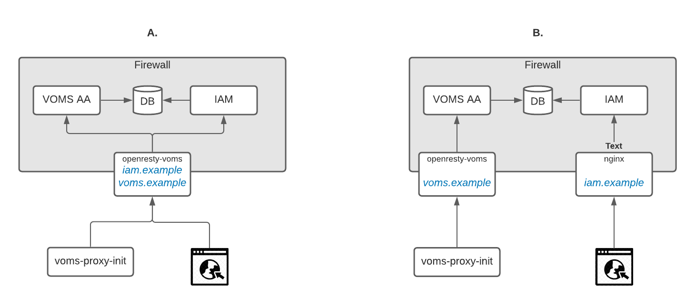

## The IAM VOMS attribute authority 

The IAM [VOMS attribute authority][voms-aa] (AA) provide backward-compatible
[VOMS][voms] support for a Virtual Organization managed with IAM. 

### Deployment architecture



The VOMS attribute authority can access the IAM database and encode IAM groups
and other attributes in a standard VOMS attribute certificate. This means in
practice that IAM can act both as an OAuth/OpenID Connect authorization server
and as a VOMS server for a given organization. TLS termination and client VOMS
atttribute certificate parsing and validation is delegated to [OpenResty
VOMS][openresty-voms], which can de deployed as a sidecar service that just protects the
VOMS AA or also in front of the IAM backend application. The two scenarios are
depicted above. 

In order to deploy a VOMS attribute authority, you can use the following docker
images:

- `indigoiam/openresty-voms`, for the OpenResty VOMS service
- `indigoiam/voms-aa:`, for the VOMS AA service

Deployment from packages is not currently supported for the VOMS attribute
authority.

#### OpenResty VOMS configuration

OpenResty VOMS requires:

- IGTF trust anchors properly configured; see the [EGI trust anchors
  container][egi-trustanchors] container
- the `vomsdir` folder, with the VOMS LSC configuration generated starting from
  the VOMS attribute authority X.509 credential

##### VOMS LSC configuration

Let's assume that the IAM VOMS AA will answer on `voms.local.io` for the VO
`example.vo`, to generate the LSC you need to get the subject and issuer of the
VOMS AA X.509 credential and put them in a file named as the fully qualified
domain name of the VOMS attribute authority with the `.lsc` extension.

The following command does exactly that (`X509_VOMS_DIR` can be set to any
directory where you have writing privileges):

```console
> mkdir -p ${X509_VOMS_DIR}/example.vo
> openssl x509 -in voms_local_io.cert.pem -noout -subject -issuer -nameopt compat | \
  gsed -e 's/^subject=//' -e 's/^issuer=//' > \
  ${X509_VOMS_DIR}/example.vo/voms.local.io.lsc
```

For an example nginx configuration, see the [VOMS AA docker compose
file][voms-aa-compose-openresty].


#### VOMS AA configuration

The VOMS AA is a spring boot application that shares the persistence
layer implementation with IAM, and as such can inspect the IAM database.

An example configuration for the VOMS AA service is given below, with comments 
to explain the meaning of the parameters:

```yaml
server:
  address: 0.0.0.0 # bind on all IP addresses
  port: 8080 # listen on port 8080
  use-forward-headers: true # assume you're behind a reverse proxy
  
  # change the default http header size limit to accomodate VOMS information passed 
  # down by the ngx-voms server
  max-http-header-size: 16000 
  

spring:
  main:
    banner-mode: "off" 
  
  jpa:
    open-in-view: true

  ## Database connection parameters
  datasource:
    dataSourceClassName: com.mysql.jdbc.jdbc2.optional.MysqlDataSource
    url: jdbc:mysql://${IAM_DB_HOST}:${IAM_DB_PORT:3306}/${IAM_DB_NAME}?useLegacyDatetimeCode=false&serverTimezone=UTC&useSSL=false
    username: ${IAM_DB_USERNAME}
    password: ${IAM_DB_PASSWORD}
  
  flyway:
    enabled: false
      
voms:
  tls:
    # The VOMS AA certificate 
    certificate-path: /certs/hostcert.pem

    # The VOMS AA certificate key
    private-key-path: /certs/hostkey.pem

    # Where to look for X.509 trust anchors
    trust-anchors-dir: /etc/grid-security/certificates

    # How often should trust anchors (and CRLs) be refreshed
    trust-anchors-refresh-interval-secs: 14400
  aa:
    # The VOMS attribute authority host
    host: voms.example

    # The VOMS attribute authority port. Note that this is the port on 
    # the reverse proxy, not the local service port
    port: 443

    # The VOMS VO name
    vo-name: ${VOMS_AA_VO}

    # Use FQAN legacy encoding, i.e.,
    # /voms/Role=NULL/Capability=NULL 
    # instead of
    # /voms
    use-legacy-fqan-encoding: true
```

For an example configuration, see the [VOMS AA docker compose
file][voms-aa-compose].

[openresty-voms]: https://github.com/indigo-iam/openresty-voms
[voms-aa]: https://github.com/indigo-iam/iam/tree/develop/iam-voms-aa
[voms-aa-compose-openresty]: https://github.com/indigo-iam/voms-aa/blob/master/compose/assets/openresty-voms/conf.d/voms.local.io.conf
[voms-aa-compose]:
https://github.com/indigo-iam/voms-aa/blob/master/compose/docker-compose.yml
[voms]: http://italiangrid.github.io/voms/
[egi-trustanchors]: https://github.com/indigo-iam/egi-trust-anchors-container/
