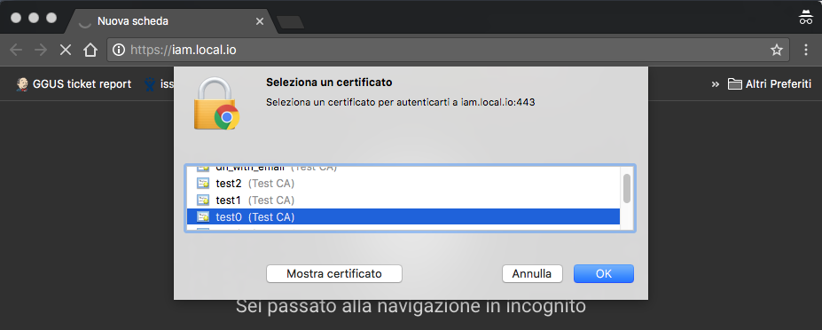
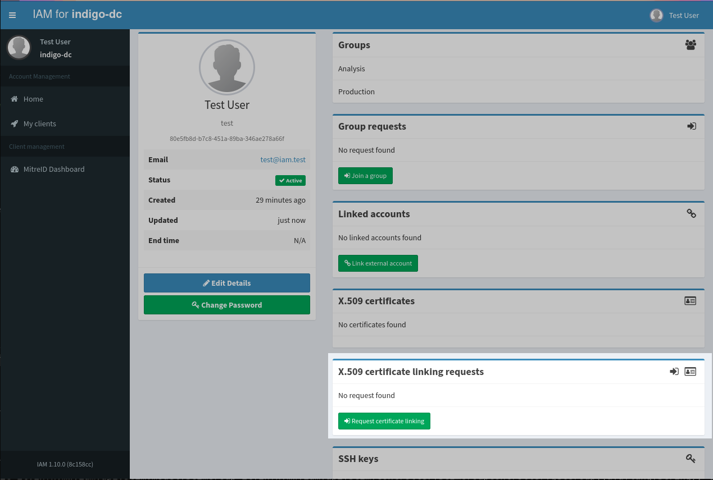
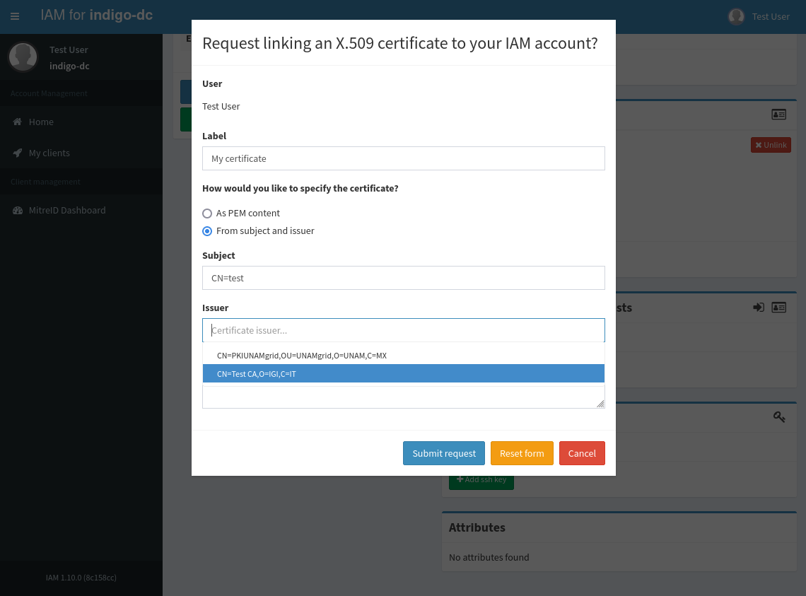

IAM provides the ability to link X.509 certificates to a user account. X.509
account linking works if:

- X.509 certificate authentication is enabled for the IAM instance in use; for
  more information on this see the [Getting started guide][getting-started-nginx]
- The certificate is correctly installed in the browser used to access the IAM;
- The certificate is trusted by the IAM (i.e. is signed by a certificate
  authority known and trusted by the IAM)

## Authenticating with an X.509 certificate 

If a certificate is correctly configured in the browser, the browser will show
a dialog to select whether to authenticate with the certificate or not as in the
following screenshot: 

Note that this happens when enstabilishing the connection to the IAM. If no
dialog is shown, either:

- there's no certificate in the browser that is trusted by the IAM (either the
  certificate is expired or signed by a CA not trusted by the IAM)
- a certificate was selected automatically by the browser when authenticating
  to the IAM

In case the certificate used for the authentication is linked to an
organization account, the IAM login page will display a "Sign in with your
certificate" button:

## Linking a certificate via TLS handshake

If a certificate was recognized but is not linked to any membership in the IAM,
the user will have to authenticate with other credentials (local username &
password, or external authentication mechanisms (e.g. Google)).

After having logged in, the user can link a certificate by clickin on the
__Link Certificate__ button:

Note that the __Link certificate__ button will be shown in the page __only if a
valid and trusted certificate was detected by the IAM during the TLS handshake__.

Clicking the __Link certificate__ button opens a dialog that shows information
about the certificate that should be linked to the account: 

If the linking completes succesfully, the linked certificate information will
be shown in the X.509 certificates panel:

To check that the linking actually works, the user can logout from the IAM and
login again with the certificate.

## Request to link a certificate manually

If you want to link a certificate to your account without adding it to your browser, you can
use the certificate linking request button

You can paste the certificate PEM content:

or insert the subject DN (with RFC2253 format) 
and select the issuer among the available ones:

After the submission a mail will be sent to the administrator, who can approve or
reject the request. You will be notified via mail of the request outcome.

## Unlinking a certificate

A user can unlink a certificate by clicking on the __Unlink__ button shown in
the certificate panel (see the image above).

[getting-started-nginx]: 
